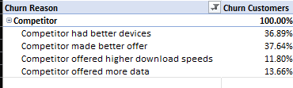
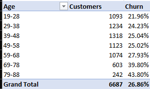
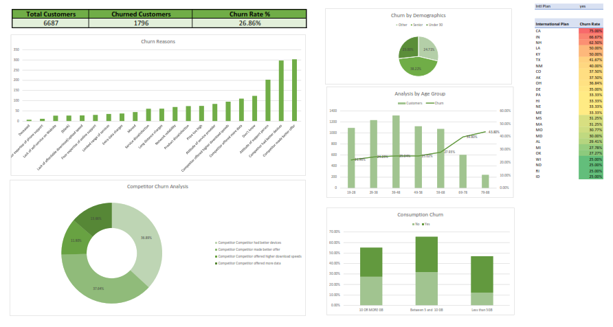
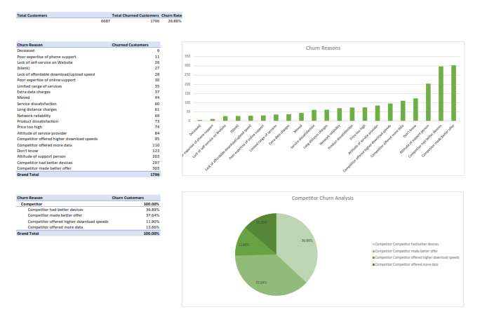
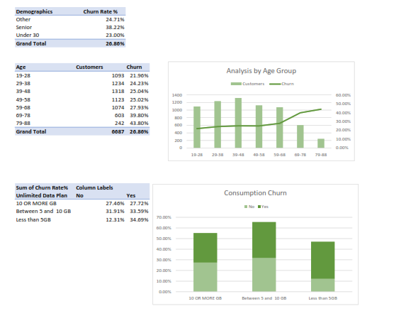

# Customer Churn Rate Analysis (Excel)

## Overview
An analysis of customer churn for a telecommunications company with a customer base of 6,687 customers, built entirely in Excel using PivotTables, aggregate summary tables, and an interactive dashboard. The goal was to identify **why customers churn** and which segments are most at risk, to support retention strategy.

## Data Source
Customer-level dataset sourced from a DataCamp exercise including account tenure, usage (calls, minutes, data), plan type, contract type, payment method, demographics, and churn status/reason. 

## Tools & Techniques Used
- PivotTables & PivotCharts
- Aggregate summary tables
- Data segmentation (age group, consumption, contract type, state)
- Dashboard design with linked charts

## Key Findings

**Overall churn rate: 26.86%** (1,796 of 6,687 customers churned)

- **Competitive pressure is the #1 driver of churn.** Among customers who left for a competitor, the leading reasons were competitors offering **better devices (36.9%)** and **better overall offers (37.6%)**, followed by higher download speeds (11.8%) and more data (13.7%) — together these competitive factors dominate the churn reasons breakdown.
  
  

- Churn is concentrated among **younger customer segments** (19–48 age range), which also make up the largest share of the customer base.
  
    
  
- Month-to-month customers exhibit noticeably higher churn compared with customers on longer-term contracts, highlighting customer commitment as an important retention factor.

## Dashboard Preview

## Churn Analysis Detail

## Customer Pivot Breakdown

## How to Use
1.📊 [Download the Excel Workbook here](excel/Churn%20Rate%20Analysis.xlsx)                                                                         
2. Open in Excel (enable editing if prompted)  
3. Navigate to the **Overview** sheet for the summary dashboard, or **Churn Analysis** / **Customer Pivot** for detailed breakdowns  
4. PivotTables can be refreshed or re-filtered to explore other segments (e.g. by state, contract type, or data usage)

## Business Reccomendations

Based on the analysis, the following actions are recommended:

- Introduce competitive pricing and promotional offers.
- Improve device upgrade programs.
- Offer incentives for customers on month-to-month contracts to transition to longer-term plans.
- Develop targeted retention campaigns for younger customers.
- Monitor competitor offerings regularly to remain competitive.

  ## Author

  **Joy Wanjiku Munga**
